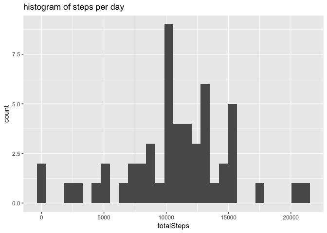
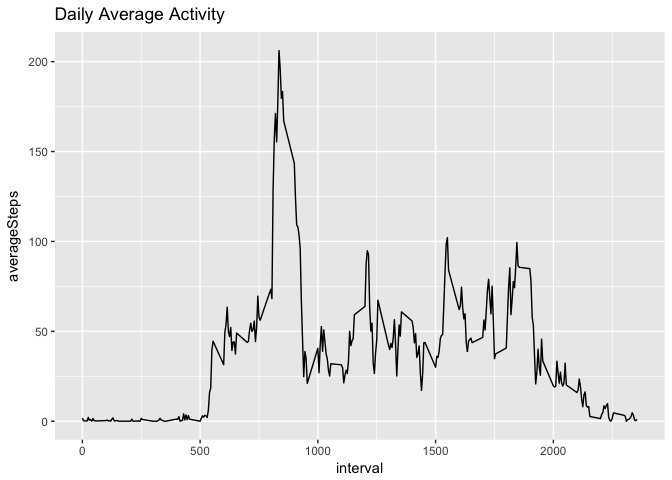
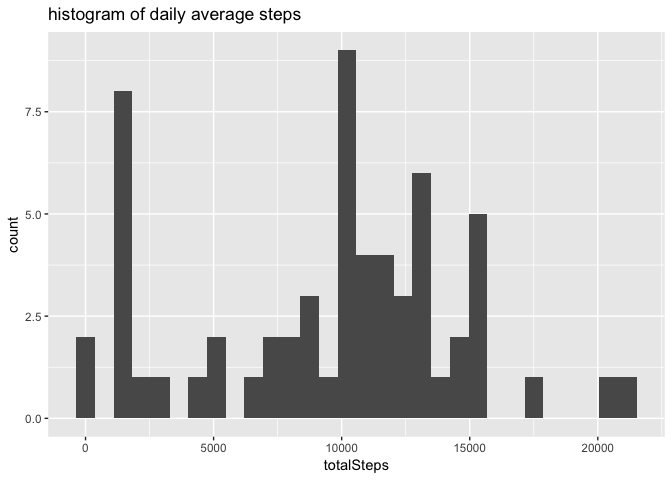
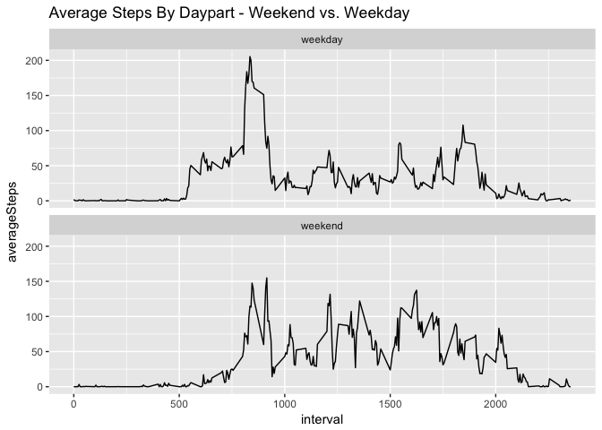

# Reproducible Research: Peer Assessment 1
## Global options, load packages

```r
library(knitr)
opts_chunk$set(echo = TRUE)
opts_chunk$set(cache = TRUE)
library(tidyverse)
```

```
## Loading tidyverse: ggplot2
## Loading tidyverse: tibble
## Loading tidyverse: tidyr
## Loading tidyverse: readr
## Loading tidyverse: purrr
## Loading tidyverse: dplyr
```

```
## Conflicts with tidy packages ----------------------------------------------
```

```
## filter(): dplyr, stats
## lag():    dplyr, stats
```

```r
library(lubridate)
```

```
## 
## Attaching package: 'lubridate'
```

```
## The following object is masked from 'package:base':
## 
##     date
```


## Loading and preprocessing the data
### choices:
- cache the csv
- change date from factor to POSIXct

```r
activity_raw = read.csv('~/Downloads/activity.csv')
activity = activity_raw %>% 
  mutate(date = as.POSIXct(date))
summary(activity)
```

```
##      steps             date                        interval     
##  Min.   :  0.00   Min.   :2012-10-01 00:00:00   Min.   :   0.0  
##  1st Qu.:  0.00   1st Qu.:2012-10-16 00:00:00   1st Qu.: 588.8  
##  Median :  0.00   Median :2012-10-31 00:00:00   Median :1177.5  
##  Mean   : 37.38   Mean   :2012-10-31 00:25:34   Mean   :1177.5  
##  3rd Qu.: 12.00   3rd Qu.:2012-11-15 00:00:00   3rd Qu.:1766.2  
##  Max.   :806.00   Max.   :2012-11-30 00:00:00   Max.   :2355.0  
##  NA's   :2304
```


## What is mean total number of steps taken per day?
- Note: all NAs that occur take up entire days, so I'm removing those days from
the data

```r
keepRows = complete.cases(activity)
byDay = activity %>% 
  filter(keepRows) %>% 
  group_by(date) %>% 
  summarise(totalSteps = sum(steps))
ggplot(data = byDay, aes(totalSteps)) + geom_histogram() + ggtitle('histogram of steps per day')
```

```
## `stat_bin()` using `bins = 30`. Pick better value with `binwidth`.
```

<!-- -->

```r
print(paste0('the mean daily steps taken was: ',round(mean(byDay$totalSteps), 2)))
```

```
## [1] "the mean daily steps taken was: 10766.19"
```

```r
print(paste0('the median daily steps taken was: ',round(median(byDay$totalSteps), 2)))
```

```
## [1] "the median daily steps taken was: 10765"
```


## What is the average daily activity pattern?

```r
keepRows = complete.cases(activity)
byInterval = activity %>% 
  filter(keepRows) %>% 
  group_by(interval) %>% 
  summarise(averageSteps = mean(steps),
            medianSteps = median(steps))
ggplot(byInterval, aes(interval, averageSteps)) + geom_line() + ggtitle('Daily Average Activity')
```

<!-- -->

```r
mostSteps = which.max(byInterval$averageSteps)
print(paste0('interval ',byInterval$interval[mostSteps],' had the most average steps, with ',round(byInterval$averageSteps[mostSteps]),'.'))
```

```
## [1] "interval 835 had the most average steps, with 206."
```


## Imputing missing values
- Note: imputing missing values by taking the median steps taken at that time interval

```r
print(paste0('there are ', sum(is.na(activity)), ' NA rows in the data set.'))
```

```
## [1] "there are 2304 NA rows in the data set."
```

```r
activity_imputed = activity %>% 
  left_join(byInterval) %>% 
  select(-averageSteps) %>% 
  mutate(steps = ifelse(is.na(steps), medianSteps, steps)) %>% 
  select(-medianSteps)
```

```
## Joining, by = "interval"
```

```r
byDay_imputed = activity_imputed %>% 
  group_by(date) %>% 
  summarise(totalSteps = sum(steps))

ggplot(byDay_imputed, aes(totalSteps)) + geom_histogram() + ggtitle('histogram of daily average steps')
```

```
## `stat_bin()` using `bins = 30`. Pick better value with `binwidth`.
```

<!-- -->

```r
print(paste0('the mean daily steps taken was: ',round(mean(byDay_imputed$totalSteps), 2)))
```

```
## [1] "the mean daily steps taken was: 9503.87"
```

```r
print(paste0('the median daily steps taken was: ',round(median(byDay_imputed$totalSteps), 2)))
```

```
## [1] "the median daily steps taken was: 10395"
```
### Impact of imputing NAs:
1. Mean and Median both changed slightly.
2. Both summary statistics dropped from their values when I just dropped NAs.
3. However, the mean saw a bigger drop than the median.


## Are there differences in activity patterns between weekdays and weekends?

```r
activity_imputed = activity_imputed %>% 
  mutate(weekDay = wday(date, label = TRUE)) %>% 
  mutate(weekPart = ifelse(weekDay == 'Sun'|weekDay == 'Sat','weekend','weekday')) %>% mutate(weekPart = as.factor(weekPart)) %>% 
  select(-weekDay)

byIntervalByWeekPart = activity_imputed %>% 
  group_by(interval, weekPart) %>% 
  summarise(averageSteps = mean(steps))

ggplot(byIntervalByWeekPart,
       aes(interval, averageSteps)) +
  geom_line() +
  facet_wrap(~ weekPart, ncol = 1) +
  ggtitle('Average Steps By Daypart - Weekend vs. Weekday')
```

<!-- -->

